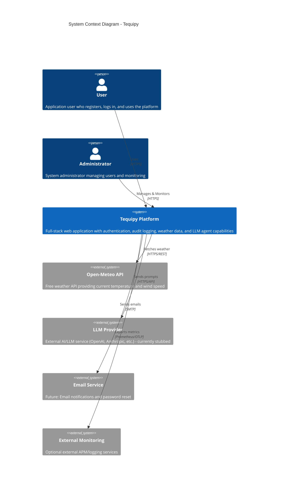

# System Context (C4 Level 1)

## Overview

The System Context diagram shows Tequipy and its relationships with users and external systems.

## System Context Diagram



## Simplified View

```
                    ┌─────────────────────────────────────────┐
                    │              USERS                       │
                    │  ┌─────────┐        ┌─────────────┐     │
                    │  │  User   │        │    Admin    │     │
                    │  └────┬────┘        └──────┬──────┘     │
                    └───────┼────────────────────┼────────────┘
                            │                    │
                            │ HTTPS              │ HTTPS
                            ▼                    ▼
              ┌─────────────────────────────────────────────────┐
              │                                                 │
              │              TEQUIPY PLATFORM                   │
              │                                                 │
              │  ┌─────────────────────────────────────────┐   │
              │  │  - User Authentication (JWT)            │   │
              │  │  - User Management                      │   │
              │  │  - Audit Logging                        │   │
              │  │  - Weather Data (Open-Meteo)            │   │
              │  │  - LLM Agent Interface                  │   │
              │  │  - Dashboard & Profile Management       │   │
              │  └─────────────────────────────────────────┘   │
              │                                                 │
              └──────────┬─────────────────┬───────────────────┘
                         │                 │
           ┌─────────────┼─────────────────┼─────────────────┐
           │             │                 │                 │
           ▼             ▼                 ▼                 ▼
┌─────────────────┐ ┌─────────────┐ ┌─────────────┐ ┌─────────────┐
│  Open-Meteo     │ │ LLM Provider│ │Email Service│ │  External   │
│  Weather API    │ │  (Stubbed)  │ │  (Future)   │ │  Monitoring │
└─────────────────┘ └─────────────┘ └─────────────┘ └─────────────┘
```

## System Boundaries

### Inside the System Boundary

| Component           | Description                                         |
| ------------------- | --------------------------------------------------- |
| User Authentication | Registration, login, JWT token management           |
| User Management     | Profile updates, password changes, account deletion |
| Audit Logging       | Tracking all significant user actions               |
| Agent Interface     | LLM prompt submission and response handling         |
| Monitoring          | Prometheus metrics, health checks                   |

### Outside the System Boundary

| External System | Purpose                                   | Integration Status              |
| --------------- | ----------------------------------------- | ------------------------------- |
| Open-Meteo API  | Real-time weather data (temp, wind speed) | **Integrated** (production)     |
| LLM Provider    | AI/ML inference for agent functionality   | Stubbed (ready for integration) |
| Email Service   | Notifications, password reset             | Not implemented                 |
| External APM    | Advanced application monitoring           | Optional                        |

## User Personas

### End User

- **Goals**: Register account, manage profile, use LLM agent features
- **Interactions**: Web UI via browser (HTTPS)
- **Authentication**: Email/password with JWT tokens

### Administrator

- **Goals**: Monitor system health, view audit logs, manage users
- **Interactions**: Web UI, Grafana dashboards, direct database access
- **Authentication**: Same as end user (role-based access not yet implemented)

## Quality Attributes

| Attribute     | Target               | Implementation                            |
| ------------- | -------------------- | ----------------------------------------- |
| Availability  | 99.9% uptime         | Health checks, container restarts         |
| Security      | OWASP compliance     | JWT auth, HTTPS, security headers         |
| Scalability   | Horizontal scaling   | Stateless backend, Redis for shared state |
| Performance   | <200ms p95 latency   | Async I/O, connection pooling             |
| Observability | Full request tracing | Prometheus metrics, correlation IDs       |
