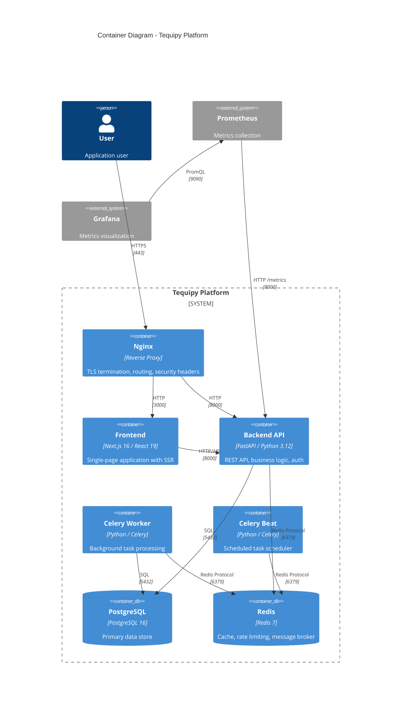

# Container Architecture (C4 Level 2)

## Overview

The Container diagram shows the high-level technology choices and how containers communicate.

## Container Diagram



## Container Overview

```
┌────────────────────────────────────────────────────────────────────────────┐
│                              DOCKER COMPOSE                                 │
│                                                                            │
│  ┌──────────────────────────────────────────────────────────────────────┐ │
│  │                         NGINX (Port 80/443)                          │ │
│  │                    TLS Termination + Routing                         │ │
│  └─────────────────────────────┬────────────────────────────────────────┘ │
│                                │                                           │
│            ┌───────────────────┴───────────────────┐                      │
│            │                                       │                      │
│            ▼                                       ▼                      │
│  ┌─────────────────────┐              ┌─────────────────────┐            │
│  │     FRONTEND        │              │      BACKEND        │            │
│  │   Next.js (3000)    │─────────────▶│   FastAPI (8000)    │            │
│  │                     │   API Calls  │                     │            │
│  └─────────────────────┘              └──────────┬──────────┘            │
│                                                  │                        │
│                    ┌─────────────────────────────┼─────────────────┐     │
│                    │                             │                 │     │
│                    ▼                             ▼                 ▼     │
│  ┌─────────────────────┐              ┌─────────────────────────────┐   │
│  │     POSTGRESQL      │              │          REDIS              │   │
│  │      (5432)         │              │         (6379)              │   │
│  │   Primary Store     │              │  Cache + Message Broker     │   │
│  └─────────────────────┘              └──────────┬──────────────────┘   │
│                    ▲                             │                       │
│                    │                             │                       │
│  ┌─────────────────┴───────────────┐            │                       │
│  │       CELERY WORKER             │◀───────────┘                       │
│  │    Background Tasks             │                                    │
│  └─────────────────────────────────┘                                    │
│                    ▲                                                     │
│                    │                                                     │
│  ┌─────────────────┴───────────────┐                                    │
│  │       CELERY BEAT               │                                    │
│  │    Scheduled Tasks              │                                    │
│  └─────────────────────────────────┘                                    │
│                                                                          │
│  ┌─────────────────────┐              ┌─────────────────────┐           │
│  │     PROMETHEUS      │─────────────▶│      GRAFANA        │           │
│  │      (9091)         │              │      (3001)         │           │
│  └─────────────────────┘              └─────────────────────┘           │
│                                                                          │
│  ┌─────────────────────┐                                                │
│  │      PGADMIN        │                                                │
│  │      (5050)         │                                                │
│  └─────────────────────┘                                                │
└────────────────────────────────────────────────────────────────────────────┘
```

## Container Specifications

### Nginx (Reverse Proxy)

| Property | Value                                      |
| -------- | ------------------------------------------ |
| Image    | `nginx:1.27-alpine`                        |
| Ports    | 80 (HTTP), 443 (HTTPS)                     |
| Purpose  | TLS termination, routing, security headers |
| Config   | `/nginx/conf.d/app.conf`                   |

**Routing Rules:**

- `/api/*` → Backend (port 8000)
- `/*` → Frontend (port 3000)
- `/metrics` → Blocked (403)

**Security Headers:**

- `X-Frame-Options: DENY`
- `X-Content-Type-Options: nosniff`
- `Strict-Transport-Security: max-age=31536000`
- `Referrer-Policy: strict-origin-when-cross-origin`

### Frontend (Next.js)

| Property  | Value                       |
| --------- | --------------------------- |
| Framework | Next.js 16 with React 19    |
| Port      | 3000                        |
| Build     | `Dockerfile` in `/frontend` |
| Styling   | Tailwind CSS 4              |

**Key Features:**

- App Router (file-based routing)
- Server-side rendering (SSR)
- TypeScript strict mode
- JWT token management in localStorage

### Backend (FastAPI)

| Property        | Value                      |
| --------------- | -------------------------- |
| Framework       | FastAPI with Python 3.12   |
| Port            | 8000                       |
| Build           | `Dockerfile` in `/backend` |
| Package Manager | uv                         |

**Key Features:**

- Async SQLAlchemy for database operations
- JWT authentication with access/refresh tokens
- Rate limiting via Redis
- Prometheus metrics instrumentation
- Structured JSON logging

### Celery Worker

| Property    | Value             |
| ----------- | ----------------- |
| Framework   | Celery 5.6        |
| Broker      | Redis             |
| Backend     | Redis             |
| Concurrency | Default (prefork) |

**Purpose:** Process background tasks asynchronously.

### Celery Beat

| Property       | Value      |
| -------------- | ---------- |
| Framework      | Celery 5.6 |
| Schedule Store | Redis      |

**Purpose:** Schedule periodic tasks (singleton instance).

### PostgreSQL

| Property | Value                |
| -------- | -------------------- |
| Image    | `postgres:16-alpine` |
| Port     | 5432                 |
| Volume   | `postgres-data`      |

**Stores:**

- Users (`users` table)
- Audit Events (`audit_events` table)
- Refresh Tokens (`refresh_tokens` table)

### Redis

| Property    | Value                |
| ----------- | -------------------- |
| Image       | `redis:7-alpine`     |
| Port        | 6379                 |
| Persistence | Disabled (ephemeral) |

**Uses:**

- Rate limiting counters
- Celery message broker
- Celery result backend
- Session/cache data (future)

## Network Communication

| From       | To         | Protocol | Port | Purpose                |
| ---------- | ---------- | -------- | ---- | ---------------------- |
| User       | Nginx      | HTTPS    | 443  | All traffic            |
| Nginx      | Frontend   | HTTP     | 3000 | UI requests            |
| Nginx      | Backend    | HTTP     | 8000 | API requests           |
| Backend    | PostgreSQL | TCP      | 5432 | Data persistence       |
| Backend    | Redis      | TCP      | 6379 | Caching, rate limiting |
| Worker     | PostgreSQL | TCP      | 5432 | Task data access       |
| Worker     | Redis      | TCP      | 6379 | Task queue             |
| Prometheus | Backend    | HTTP     | 8000 | Metrics scraping       |

## Health Checks

| Container  | Endpoint/Command     | Interval |
| ---------- | -------------------- | -------- |
| PostgreSQL | `pg_isready`         | 10s      |
| Redis      | `redis-cli ping`     | 10s      |
| Backend    | `GET /api/v1/health` | 30s      |
| Frontend   | Container health     | -        |
