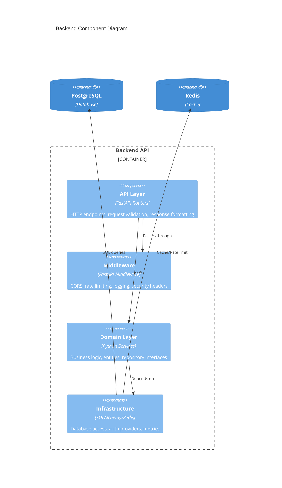
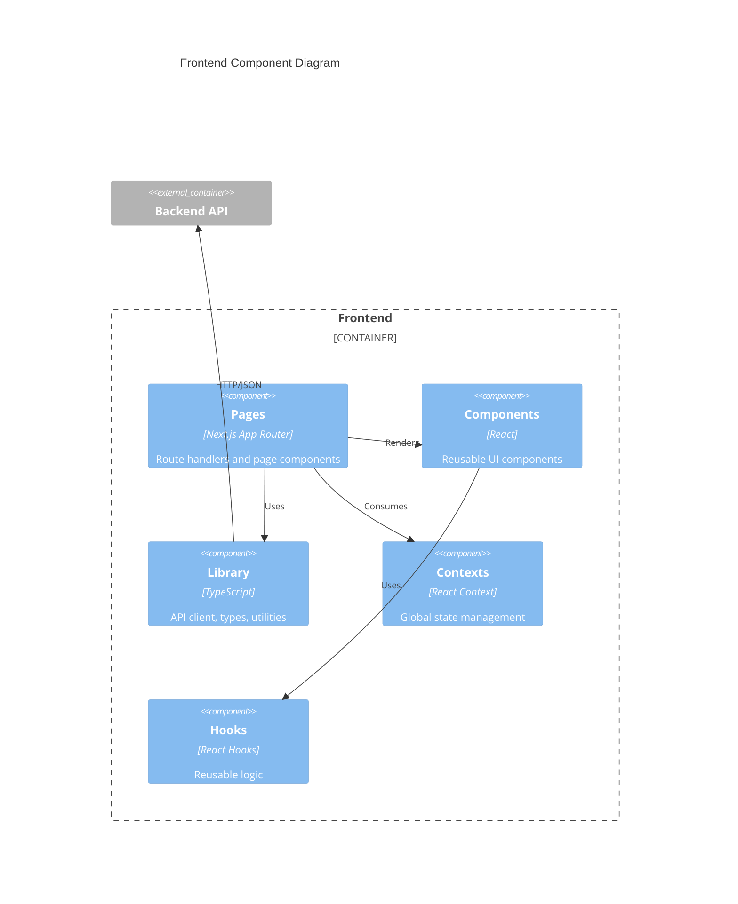

# Component Architecture (C4 Level 3)

## Overview

This document details the internal component structure of the Backend and Frontend containers.

## Backend Component Diagram



## Backend Layer Architecture

```
backend/src/
├── api/                    # API Layer (Presentation)
│   ├── app.py             # FastAPI application factory
│   ├── schemas.py         # Pydantic request/response models
│   ├── middleware/        # Request processing middleware
│   │   ├── logging.py     # Request/response logging
│   │   ├── metrics.py     # Prometheus instrumentation
│   │   ├── rate_limit.py  # Redis-based rate limiting
│   │   └── security.py    # Security headers
│   └── v1/                # API version 1 routes
│       ├── auth.py        # Authentication endpoints
│       ├── audit.py       # Audit log endpoints
│       ├── agents.py      # LLM agent endpoints
│       └── health.py      # Health check endpoints
│
├── domain/                 # Domain Layer (Business Logic)
│   ├── entities.py        # Domain entities (User, AuditEvent, RefreshToken)
│   ├── value_objects.py   # Value objects (EventType enum)
│   ├── exceptions.py      # Domain exceptions
│   ├── repositories.py    # Repository interfaces (abstract)
│   └── services/          # Business logic services
│       ├── auth_service.py    # Authentication logic
│       ├── agent_service.py   # LLM agent logic
│       └── metrics_provider.py # Metrics abstraction
│
├── infrastructure/         # Infrastructure Layer (External Concerns)
│   ├── dependencies.py    # FastAPI dependency injection setup
│   ├── database/
│   │   ├── models.py      # SQLAlchemy ORM models
│   │   └── session.py     # Database session management
│   ├── repositories/      # Repository implementations
│   │   ├── user_repo.py
│   │   ├── audit_repo.py
│   │   └── refresh_token_repo.py
│   ├── auth/
│   │   ├── jwt_provider.py    # JWT token creation/validation
│   │   ├── password.py        # Password hashing (bcrypt)
│   │   └── rate_limiter.py    # Redis rate limiter
│   ├── agents/
│   │   └── providers.py       # LLM provider abstraction
│   └── metrics/
│       └── prometheus.py      # Prometheus metrics provider
│
├── core/                   # Cross-cutting concerns
│   ├── config.py          # Application settings (Pydantic)
│   ├── logging.py         # Logging configuration
│   └── time.py            # UTC time utilities
│
└── worker/                 # Background processing
    ├── celery_app.py      # Celery application
    └── tasks.py           # Celery tasks
```

## Component Details

### API Layer Components

#### FastAPI Application (`api/app.py`)

```python
# Responsibilities:
# - Create and configure FastAPI app
# - Register routers and middleware
# - Set up exception handlers
# - Configure OpenAPI documentation

Key Functions:
- create_app() -> FastAPI
- Exception handlers for DomainException, ValidationError
- Prometheus instrumentation setup
```

#### Routers (`api/v1/`)

| Router      | Prefix           | Endpoints                                              |
| ----------- | ---------------- | ------------------------------------------------------ |
| `auth.py`   | `/api/v1/auth`   | register, login, refresh, me, change-password, profile |
| `audit.py`  | `/api/v1/audit`  | list audit events                                      |
| `agents.py` | `/api/v1/agents` | run agent prompt                                       |
| `health.py` | `/api/v1`        | health, readiness                                      |

#### Middleware Stack

```
Request → RequestLoggingMiddleware
        → MetricsMiddleware
        → RateLimitMiddleware
        → SecurityHeadersMiddleware
        → CORSMiddleware
        → Router Handler
        → Response
```

### Domain Layer Components

#### Entities

```python
class User:
    id: UUID
    email: str
    password_hash: str
    full_name: Optional[str]
    is_active: bool
    created_at: datetime
    updated_at: datetime

class AuditEvent:
    id: UUID
    user_id: Optional[UUID]
    event_type: EventType
    resource_id: Optional[UUID]
    details: Dict
    created_at: datetime

class RefreshToken:
    id: UUID
    user_id: UUID
    token_hash: str
    expires_at: datetime
    revoked: bool
```

#### Repository Interfaces

```python
class UserRepository(ABC):
    async def create(user: User) -> User
    async def get_by_id(user_id: UUID) -> Optional[User]
    async def get_by_email(email: str) -> Optional[User]
    async def update(user: User) -> User
    async def delete(user_id: UUID) -> None

class AuditEventRepository(ABC):
    async def create(event: AuditEvent) -> AuditEvent
    async def list(...) -> tuple[List[AuditEvent], int]

class RefreshTokenRepository(ABC):
    async def create(token: RefreshToken) -> RefreshToken
    async def get_by_token_hash(hash: str) -> Optional[RefreshToken]
    async def revoke_by_user_id(user_id: UUID) -> None
    async def revoke_by_token_hash(hash: str) -> None
```

#### Services

**AuthService** - Core authentication business logic:

- `register()` - Create new user with password validation
- `login()` - Authenticate and issue tokens
- `refresh_access_token()` - Rotate tokens
- `change_password()` - Update password with validation
- `update_profile()` - Update user profile
- `delete_account()` - Remove user and revoke tokens

**AgentService** - LLM agent orchestration:

- `run()` - Execute prompt against LLM provider

### Infrastructure Layer Components

#### Dependency Injection (`infrastructure/dependencies.py`)

```python
# FastAPI Depends() factories:
get_user_repository(db) -> UserRepository
get_audit_repository(db) -> AuditEventRepository
get_refresh_token_repository(db) -> RefreshTokenRepository
get_metrics_provider() -> MetricsProvider
get_rate_limiter() -> AuthRateLimiter
get_auth_service(...) -> AuthService
get_agent_service() -> AgentService
```

#### Database Models

SQLAlchemy ORM models that map to PostgreSQL tables:

- `UserModel` → `users` table
- `AuditEventModel` → `audit_events` table
- `RefreshTokenModel` → `refresh_tokens` table

---

## Frontend Component Diagram



## Frontend Structure

```
frontend/src/
├── app/                    # Next.js App Router
│   ├── layout.tsx         # Root layout with providers
│   ├── page.tsx           # Home page (redirects to login)
│   ├── login/
│   │   └── page.tsx       # Login form
│   ├── register/
│   │   └── page.tsx       # Registration form
│   ├── dashboard/
│   │   └── page.tsx       # Protected dashboard
│   ├── profile/
│   │   └── page.tsx       # User profile management
│   └── agents/
│       └── page.tsx       # LLM agent interface
│
├── components/             # Reusable UI components
│   └── ui/                # Base UI components
│
├── lib/                    # Shared utilities
│   ├── api/
│   │   └── client.ts      # API client with auth
│   ├── types/
│   │   └── api.ts         # TypeScript API types
│   └── utils/             # Helper functions
│
├── contexts/               # React contexts
│   └── auth.tsx           # Authentication context (future)
│
├── hooks/                  # Custom React hooks
│   └── useAuth.ts         # Auth state hook (future)
│
├── config/
│   └── constants.ts       # App configuration
│
└── styles/
    └── globals.css        # Global styles + Tailwind
```

## Frontend Key Components

### API Client (`lib/api/client.ts`)

```typescript
class ApiClient {
  // Token management
  setAccessToken(token: string | null);
  getAccessToken(): string | null;

  // Request methods
  private request<T>(endpoint, options): Promise<T>;

  // Auth endpoints
  auth: {
    register(data): Promise<UserResponse>;
    login(data): Promise<TokenResponse>;
    logout(): void;
    refreshToken(data): Promise<TokenResponse>;
    changePassword(data): Promise<void>;
    updateProfile(data): Promise<UserResponse>;
    me(): Promise<UserResponse>;
    deleteAccount(): Promise<void>;
  };

  // Audit endpoints
  audit: {
    list(params): Promise<AuditEventListResponse>;
  };

  // Agent endpoints
  agents: {
    run(data): Promise<AgentRunResponse>;
  };
}
```

### Pages

| Page      | Route        | Auth Required | Description               |
| --------- | ------------ | ------------- | ------------------------- |
| Home      | `/`          | No            | Redirects to login        |
| Login     | `/login`     | No            | Email/password login form |
| Register  | `/register`  | No            | User registration form    |
| Dashboard | `/dashboard` | Yes           | Main authenticated view   |
| Profile   | `/profile`   | Yes           | Profile management        |
| Agents    | `/agents`    | Yes           | LLM prompt interface      |

## Data Flow

### Authentication Flow

```
┌──────────┐     ┌──────────┐     ┌──────────┐     ┌──────────┐
│  User    │────▶│ Frontend │────▶│  Backend │────▶│ Database │
│          │     │          │     │          │     │          │
│ 1. Enter │     │ 2. POST  │     │ 3. Verify│     │ 4. Query │
│ Creds    │     │ /login   │     │ Password │     │ User     │
│          │◀────│          │◀────│          │◀────│          │
│ 7. Store │     │ 6. Store │     │ 5. Issue │     │          │
│ in UI    │     │ Token    │     │ JWT      │     │          │
└──────────┘     └──────────┘     └──────────┘     └──────────┘
```

### API Request Flow

```
Frontend Request
      │
      ▼
┌─────────────────┐
│ ApiClient       │ ──▶ Add JWT to Authorization header
└────────┬────────┘
         │
         ▼
┌─────────────────┐
│ Nginx           │ ──▶ Route to backend
└────────┬────────┘
         │
         ▼
┌─────────────────┐
│ FastAPI         │
│ Middleware      │ ──▶ Logging, Metrics, Rate Limit
└────────┬────────┘
         │
         ▼
┌─────────────────┐
│ Router          │ ──▶ Validate request, extract user from JWT
└────────┬────────┘
         │
         ▼
┌─────────────────┐
│ Service         │ ──▶ Business logic
└────────┬────────┘
         │
         ▼
┌─────────────────┐
│ Repository      │ ──▶ Database operations
└─────────────────┘
```
