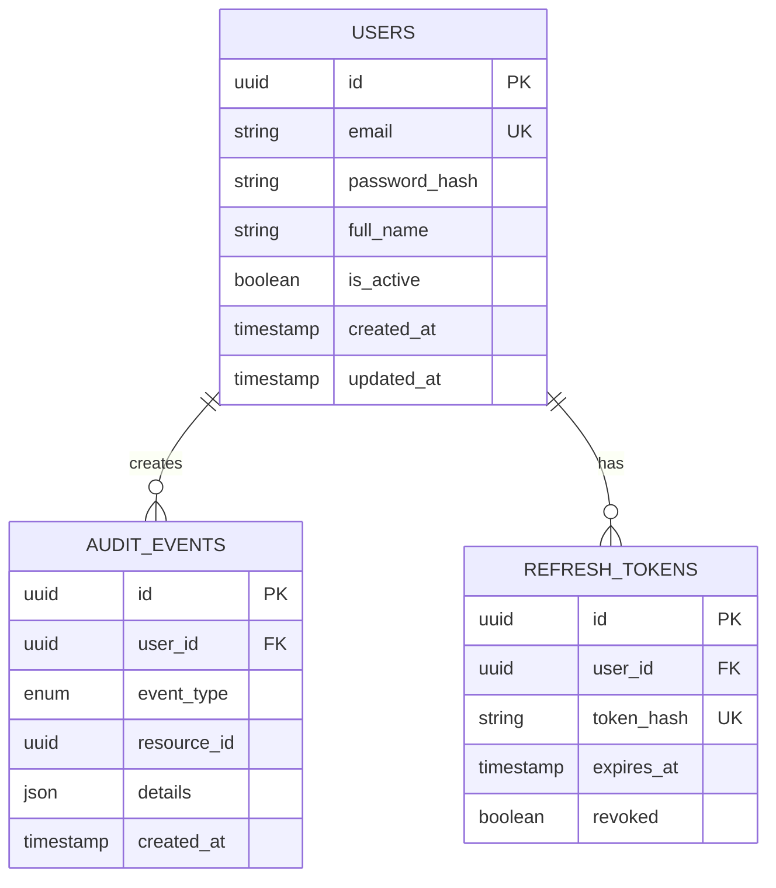

# Data Architecture

## Overview

This document describes the data models, database schema, and data flow patterns in Tequipy.

## Database Technology

| Property   | Value                  |
| ---------- | ---------------------- |
| DBMS       | PostgreSQL 16          |
| ORM        | SQLAlchemy 2.x (async) |
| Migrations | Alembic                |
| Connection | asyncpg driver         |

## Entity Relationship Diagram



## Table Schemas

### users

Primary table for user accounts.

```sql
CREATE TABLE users (
    id UUID PRIMARY KEY DEFAULT gen_random_uuid(),
    email VARCHAR(255) NOT NULL UNIQUE,
    password_hash VARCHAR(255) NOT NULL,
    full_name VARCHAR(255),
    is_active BOOLEAN NOT NULL DEFAULT true,
    created_at TIMESTAMP NOT NULL DEFAULT NOW(),
    updated_at TIMESTAMP NOT NULL DEFAULT NOW()
);

CREATE INDEX ix_users_email ON users(email);
```

| Column        | Type         | Constraints            | Description            |
| ------------- | ------------ | ---------------------- | ---------------------- |
| id            | UUID         | PK                     | Unique identifier      |
| email         | VARCHAR(255) | UNIQUE, NOT NULL       | User email address     |
| password_hash | VARCHAR(255) | NOT NULL               | bcrypt hashed password |
| full_name     | VARCHAR(255) | nullable               | Display name           |
| is_active     | BOOLEAN      | NOT NULL, default true | Account status         |
| created_at    | TIMESTAMP    | NOT NULL               | Account creation time  |
| updated_at    | TIMESTAMP    | NOT NULL               | Last modification time |

### audit_events

Immutable log of all significant user actions.

```sql
CREATE TABLE audit_events (
    id UUID PRIMARY KEY DEFAULT gen_random_uuid(),
    user_id UUID REFERENCES users(id) ON DELETE SET NULL,
    event_type VARCHAR(50) NOT NULL,
    resource_id UUID,
    details JSONB NOT NULL DEFAULT '{}',
    created_at TIMESTAMP NOT NULL DEFAULT NOW()
);

CREATE INDEX ix_audit_events_user_id ON audit_events(user_id);
CREATE INDEX ix_audit_events_event_type ON audit_events(event_type);
CREATE INDEX ix_audit_events_resource_id ON audit_events(resource_id);
CREATE INDEX ix_audit_events_created_at ON audit_events(created_at);
```

| Column      | Type      | Constraints                       | Description               |
| ----------- | --------- | --------------------------------- | ------------------------- |
| id          | UUID      | PK                                | Unique identifier         |
| user_id     | UUID      | FK → users.id, ON DELETE SET NULL | User who triggered event  |
| event_type  | ENUM      | NOT NULL                          | Type of event (see below) |
| resource_id | UUID      | nullable                          | Related resource ID       |
| details     | JSONB     | NOT NULL, default {}              | Additional event data     |
| created_at  | TIMESTAMP | NOT NULL                          | Event timestamp           |

**Event Types:**

- `USER_REGISTERED` - New user registration
- `USER_LOGGED_IN` - Successful login
- `USER_LOGGED_OUT` - User logout
- `PASSWORD_CHANGED` - Password update
- `USER_UPDATED` - Profile update
- `USER_DELETED` - Account deletion
- `RESOURCE_CREATED` - Generic resource creation
- `RESOURCE_UPDATED` - Generic resource update
- `RESOURCE_DELETED` - Generic resource deletion

### refresh_tokens

JWT refresh tokens for secure token rotation.

```sql
CREATE TABLE refresh_tokens (
    id UUID PRIMARY KEY DEFAULT gen_random_uuid(),
    user_id UUID NOT NULL REFERENCES users(id) ON DELETE CASCADE,
    token_hash VARCHAR(255) NOT NULL UNIQUE,
    expires_at TIMESTAMP NOT NULL,
    revoked BOOLEAN NOT NULL DEFAULT false
);

CREATE INDEX ix_refresh_tokens_user_id ON refresh_tokens(user_id);
CREATE INDEX ix_refresh_tokens_token_hash ON refresh_tokens(token_hash);
CREATE INDEX ix_refresh_tokens_expires_at ON refresh_tokens(expires_at);
CREATE INDEX ix_refresh_tokens_revoked ON refresh_tokens(revoked);
```

| Column     | Type         | Constraints                      | Description           |
| ---------- | ------------ | -------------------------------- | --------------------- |
| id         | UUID         | PK                               | Unique identifier     |
| user_id    | UUID         | FK → users.id, ON DELETE CASCADE | Token owner           |
| token_hash | VARCHAR(255) | UNIQUE, NOT NULL                 | SHA-256 hash of token |
| expires_at | TIMESTAMP    | NOT NULL                         | Token expiration time |
| revoked    | BOOLEAN      | NOT NULL, default false          | Revocation status     |

## Data Flow Diagrams

### User Registration Flow

```
┌──────────┐     ┌──────────┐     ┌──────────────┐     ┌──────────┐
│ Frontend │────▶│  Backend │────▶│ AuthService  │────▶│   DB     │
│          │     │          │     │              │     │          │
│ POST     │     │ Validate │     │ Hash password│     │ INSERT   │
│ /register│     │ Schema   │     │ Create user  │     │ users    │
│          │◀────│          │◀────│              │◀────│          │
│ 201      │     │ Response │     │ Return user  │     │ user row │
└──────────┘     └──────────┘     └──────────────┘     └──────────┘
                                         │
                                         ▼
                                  ┌──────────────┐
                                  │ Audit Event  │
                                  │ USER_REGISTERED
                                  └──────────────┘
```

### Authentication Flow

```
┌──────────┐     ┌──────────┐     ┌──────────────┐     ┌──────────┐
│ Frontend │────▶│  Backend │────▶│ AuthService  │────▶│   DB     │
│          │     │          │     │              │     │          │
│ POST     │     │ Rate     │     │ 1. Get user  │     │ SELECT   │
│ /login   │     │ Limit    │     │ 2. Verify pw │     │ users    │
│          │     │ Check    │     │ 3. Issue JWT │     │          │
│          │     │          │     │ 4. Save token│────▶│ INSERT   │
│          │◀────│          │◀────│              │     │ refresh_ │
│ JWT pair │     │ Response │     │              │     │ tokens   │
└──────────┘     └──────────┘     └──────────────┘     └──────────┘
                                         │
                                         ▼
                                  ┌──────────────┐
                                  │ Audit Event  │
                                  │ USER_LOGGED_IN
                                  └──────────────┘
```

### Token Refresh Flow

```
┌──────────┐     ┌──────────────┐     ┌──────────┐
│ Frontend │────▶│ AuthService  │────▶│   DB     │
│          │     │              │     │          │
│ POST     │     │ 1. Verify JWT│     │ SELECT   │
│ /refresh │     │ 2. Find token│────▶│ refresh_ │
│          │     │ 3. Revoke old│────▶│ tokens   │
│          │     │ 4. Issue new │────▶│ UPDATE   │
│          │◀────│              │     │ INSERT   │
│ New JWT  │     │              │     │          │
└──────────┘     └──────────────┘     └──────────┘
```

## Redis Data Structures

Redis is used for ephemeral data that doesn't require persistence.

### Rate Limiting

```
Key Pattern: rate_limit:{ip_address}:{endpoint}
Type: String (counter)
TTL: 60 seconds
Value: Request count

Key Pattern: auth_failed:{user_id}
Type: String (counter)
TTL: 15 minutes
Value: Failed login attempts
```

### Account Lockout

```
Key Pattern: account_locked:{user_id}
Type: String
TTL: 15 minutes
Value: "1"
```

### Celery Task Queue

```
Key Pattern: celery (list)
Type: Redis list
Purpose: Task queue for background jobs

Key Pattern: celery-task-meta-{task_id}
Type: String (JSON)
Purpose: Task result storage
```

## Data Lifecycle

### User Data

| Event            | Action                                                  |
| ---------------- | ------------------------------------------------------- |
| Registration     | Create user record, audit event                         |
| Login            | Create refresh token, audit event                       |
| Profile Update   | Update user, audit event                                |
| Password Change  | Update user, revoke all tokens, audit event             |
| Account Deletion | Delete user (cascade tokens), audit event with SET NULL |

### Token Data

| Event            | Action                    |
| ---------------- | ------------------------- |
| Login            | Create new refresh token  |
| Token Refresh    | Revoke old, create new    |
| Logout           | Revoke current token      |
| Password Change  | Revoke all user tokens    |
| Account Deletion | Cascade delete all tokens |

### Audit Data

- **Immutable**: Never updated or deleted
- **Retention**: No automatic cleanup (implement per policy)
- **User deletion**: Sets `user_id` to NULL (preserves event history)

## Indexing Strategy

### Primary Indexes

All tables use UUID primary keys with default B-tree indexes.

### Secondary Indexes

| Table          | Column(s)  | Type   | Purpose               |
| -------------- | ---------- | ------ | --------------------- |
| users          | email      | UNIQUE | Login lookup          |
| audit_events   | user_id    | B-tree | User history queries  |
| audit_events   | event_type | B-tree | Event type filtering  |
| audit_events   | created_at | B-tree | Time range queries    |
| refresh_tokens | token_hash | UNIQUE | Token validation      |
| refresh_tokens | user_id    | B-tree | User token management |
| refresh_tokens | expires_at | B-tree | Cleanup queries       |

## Migration Strategy

Migrations are managed with Alembic:

```bash
# Create new migration
cd backend && uv run alembic revision --autogenerate -m "description"

# Apply migrations
cd backend && uv run alembic upgrade head

# Rollback one version
cd backend && uv run alembic downgrade -1
```

**Migration Files:** `backend/alembic/versions/`

## Backup & Recovery

### PostgreSQL

```bash
# Backup
docker exec tequipy-postgres pg_dump -U tequipy tequipy > backup.sql

# Restore
docker exec -i tequipy-postgres psql -U tequipy tequipy < backup.sql
```

### Redis

Redis is configured without persistence (ephemeral data only). No backup needed for current use case.
