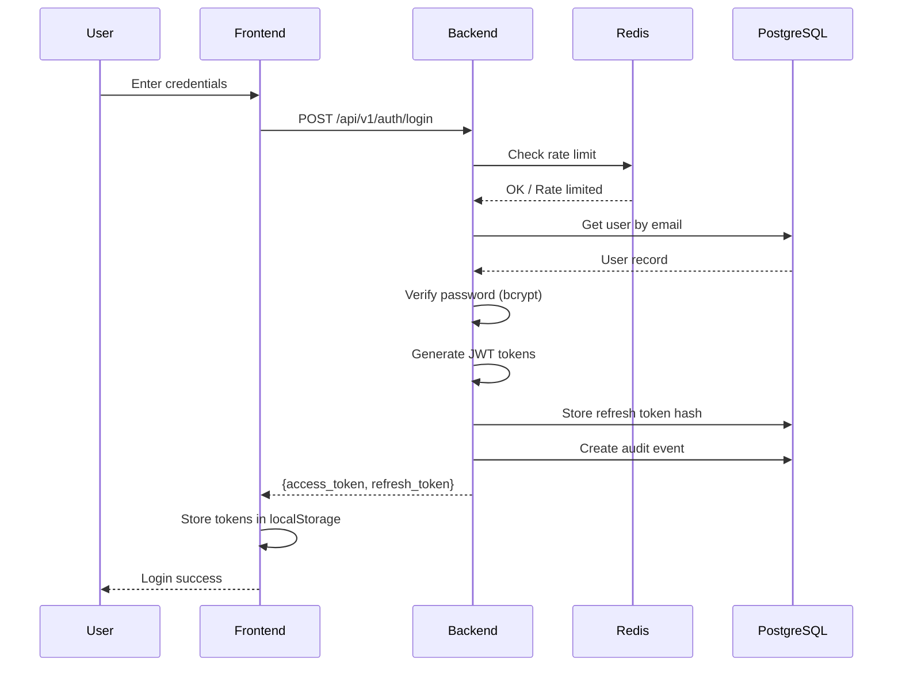
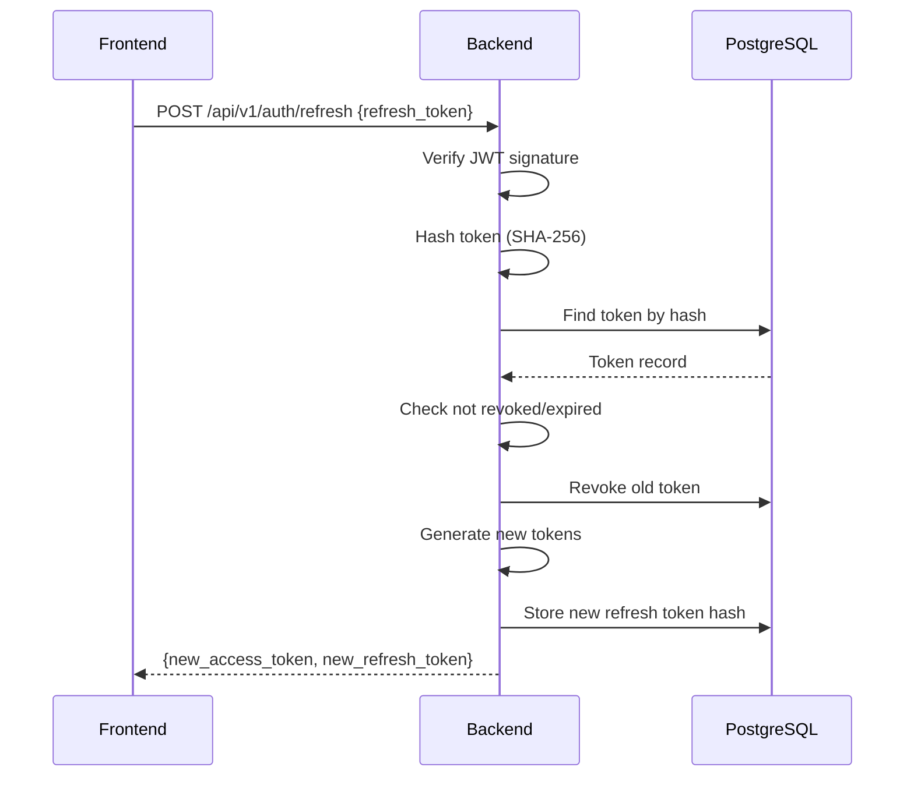

# Security Architecture

## Overview

This document describes the security model, authentication flows, and security controls implemented in Tequipy.

## Security Layers

```
┌─────────────────────────────────────────────────────────────────┐
│                        NETWORK LAYER                            │
│  • TLS 1.2/1.3 termination at Nginx                            │
│  • HTTPS redirect (port 80 → 443)                               │
│  • Strict Transport Security (HSTS)                             │
└─────────────────────────────────────────────────────────────────┘
                              │
                              ▼
┌─────────────────────────────────────────────────────────────────┐
│                       REVERSE PROXY LAYER                       │
│  • Security headers (X-Frame-Options, CSP, etc.)               │
│  • /metrics endpoint blocked from public access                 │
│  • Request size limits (25MB)                                   │
└─────────────────────────────────────────────────────────────────┘
                              │
                              ▼
┌─────────────────────────────────────────────────────────────────┐
│                      APPLICATION LAYER                          │
│  • CORS configuration                                           │
│  • Rate limiting (per IP, per user)                            │
│  • JWT authentication                                           │
│  • Input validation (Pydantic schemas)                         │
└─────────────────────────────────────────────────────────────────┘
                              │
                              ▼
┌─────────────────────────────────────────────────────────────────┐
│                        DATA LAYER                               │
│  • Password hashing (bcrypt)                                    │
│  • Token hashing (SHA-256)                                      │
│  • Parameterized queries (SQLAlchemy)                          │
│  • Audit logging                                                │
└─────────────────────────────────────────────────────────────────┘
```

## Authentication Architecture

### JWT Token Flow



### Token Structure

**Access Token (JWT)**

```json
{
  "sub": "user-uuid",
  "type": "access",
  "exp": 1234567890,
  "iat": 1234567890
}
```

**Refresh Token (JWT)**

```json
{
  "sub": "user-uuid",
  "type": "refresh",
  "exp": 1234567890,
  "iat": 1234567890
}
```

### Token Lifecycle

| Token Type    | Expiration | Storage                | Rotation        |
| ------------- | ---------- | ---------------------- | --------------- |
| Access Token  | 15 minutes | localStorage           | On refresh      |
| Refresh Token | 7 days     | localStorage + DB hash | On each refresh |

### Token Refresh Flow



## Password Security

### Hashing

- **Algorithm**: bcrypt
- **Cost Factor**: Default (10 rounds)
- **Implementation**: `bcrypt` library via `PasswordUtils`

### Password Policy

| Requirement       | Value                         |
| ----------------- | ----------------------------- |
| Minimum length    | 8 characters                  |
| Change validation | Cannot reuse current password |

### Password Change Flow

1. Verify current password
2. Validate new password meets requirements
3. Hash new password with bcrypt
4. Update user record
5. Revoke all refresh tokens (forces re-login on all devices)
6. Create audit event

## Rate Limiting

### Implementation

Rate limiting uses Redis counters with TTL.

### Limits

| Endpoint Type  | Limit        | Window     |
| -------------- | ------------ | ---------- |
| General API    | 100 requests | 1 minute   |
| Login attempts | 5 failures   | 15 minutes |

### Account Lockout

After 5 failed login attempts:

- Account is locked for 15 minutes
- Counter resets on successful login
- Lockout state stored in Redis

```python
# Redis keys
rate_limit:{ip}:{endpoint}     # General rate limit
auth_failed:{user_id}          # Failed login counter
account_locked:{user_id}       # Lockout flag
```

## Security Headers

### Nginx Headers

| Header                    | Value                               | Purpose               |
| ------------------------- | ----------------------------------- | --------------------- |
| X-Frame-Options           | DENY                                | Prevent clickjacking  |
| X-Content-Type-Options    | nosniff                             | Prevent MIME sniffing |
| Strict-Transport-Security | max-age=31536000; includeSubDomains | Force HTTPS           |
| Referrer-Policy           | strict-origin-when-cross-origin     | Control referrer info |

### Backend Headers

| Header           | Value | Purpose         |
| ---------------- | ----- | --------------- |
| X-Correlation-ID | UUID  | Request tracing |

## CORS Configuration

```python
CORSMiddleware(
    allow_origins=["http://localhost", "http://localhost:3000", "http://localhost:8000"],
    allow_credentials=True,
    allow_methods=["*"],
    allow_headers=["*"],
)
```

**Note**: In production, restrict `allow_origins` to actual domain.

## Input Validation

### Backend (Pydantic)

All API inputs validated with Pydantic schemas:

```python
class RegisterRequest(BaseModel):
    email: EmailStr
    password: str = Field(min_length=8)
    full_name: str = Field(min_length=1)

class LoginRequest(BaseModel):
    email: EmailStr
    password: str
```

### Frontend (TypeScript)

Type definitions in `lib/types/api.ts` ensure type safety at compile time.

## SQL Injection Prevention

- **ORM**: SQLAlchemy with parameterized queries
- **No raw SQL**: All queries through ORM methods
- **Async sessions**: Proper session management

Example safe query:

```python
async def get_by_email(self, email: str) -> Optional[User]:
    result = await self.db.execute(
        select(UserModel).where(UserModel.email == email)
    )
    return result.scalar_one_or_none()
```

## Audit Logging

All security-relevant events are logged to `audit_events` table:

| Event            | Logged Data                 |
| ---------------- | --------------------------- |
| USER_REGISTERED  | user_id, email (in details) |
| USER_LOGGED_IN   | user_id, client IP          |
| USER_LOGGED_OUT  | user_id                     |
| PASSWORD_CHANGED | user_id                     |
| USER_UPDATED     | user_id, changed fields     |
| USER_DELETED     | user_id                     |

## Secrets Management

### Environment Variables

Sensitive configuration via environment variables:

| Variable       | Purpose              |
| -------------- | -------------------- |
| JWT_SECRET_KEY | JWT signing key      |
| DATABASE_URL   | Database credentials |
| REDIS_URL      | Redis connection     |

### Secret Generation

```bash
# Generate JWT secret
python -c "import secrets; print(secrets.token_urlsafe(32))"
```

### Storage Recommendations

- Development: `.env` files (gitignored)
- Production: Secret manager (AWS Secrets Manager, Vault, etc.)

## Security Checklist

### Implemented

- [x] HTTPS/TLS termination
- [x] Security headers
- [x] JWT authentication
- [x] Password hashing (bcrypt)
- [x] Rate limiting
- [x] Account lockout
- [x] Token rotation
- [x] CORS configuration
- [x] Input validation
- [x] SQL injection prevention
- [x] Audit logging
- [x] Correlation IDs

### Recommendations for Production

- [ ] Content Security Policy (CSP) header
- [ ] Implement CSRF protection for state-changing operations
- [ ] Add IP-based suspicious activity detection
- [ ] Implement password strength requirements (complexity)
- [ ] Add multi-factor authentication (MFA)
- [ ] Implement session binding (device fingerprinting)
- [ ] Add security event alerting
- [ ] Regular security audits and penetration testing
- [ ] Implement API versioning deprecation policy
- [ ] Add request signing for sensitive operations
