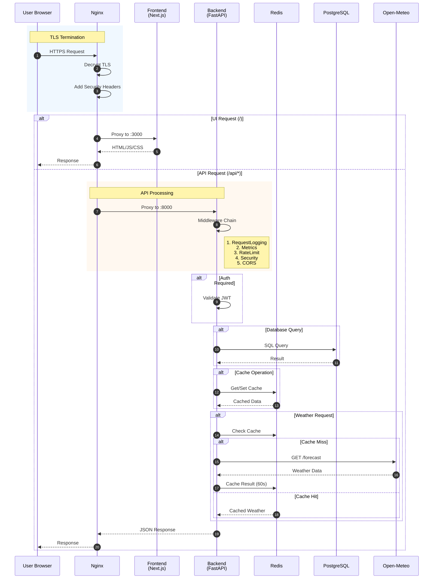
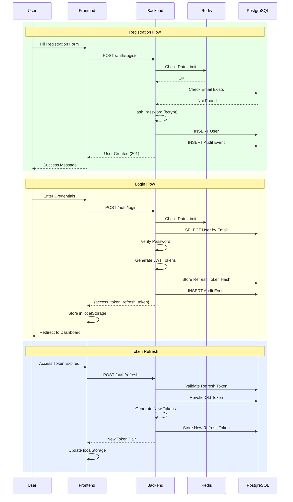
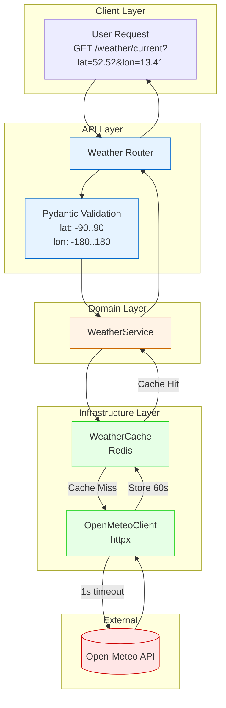
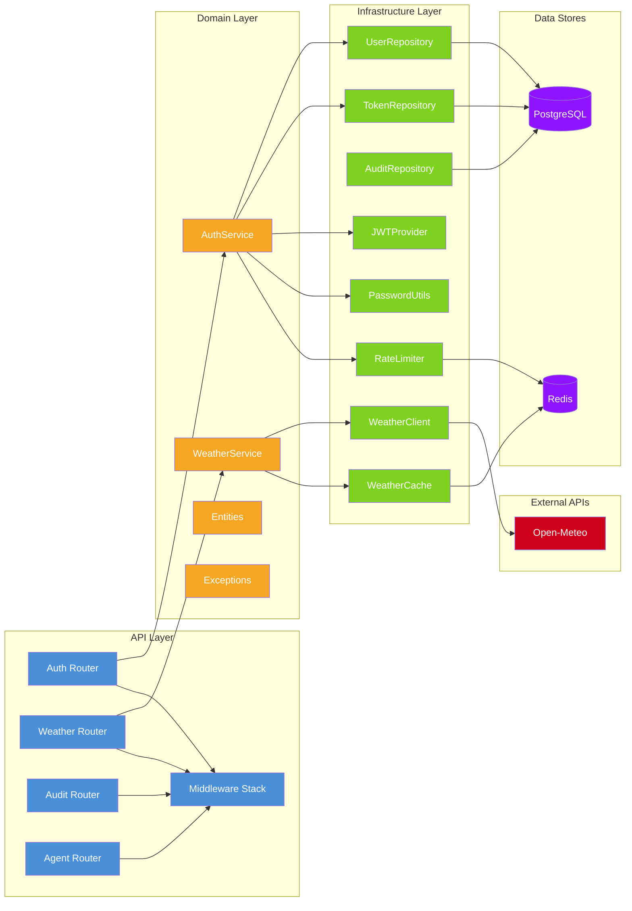
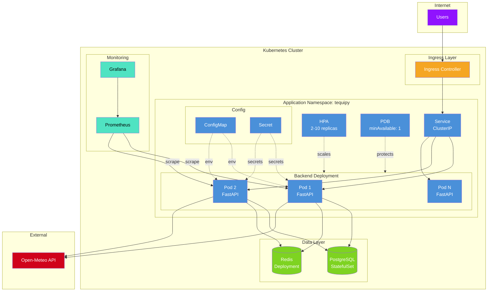
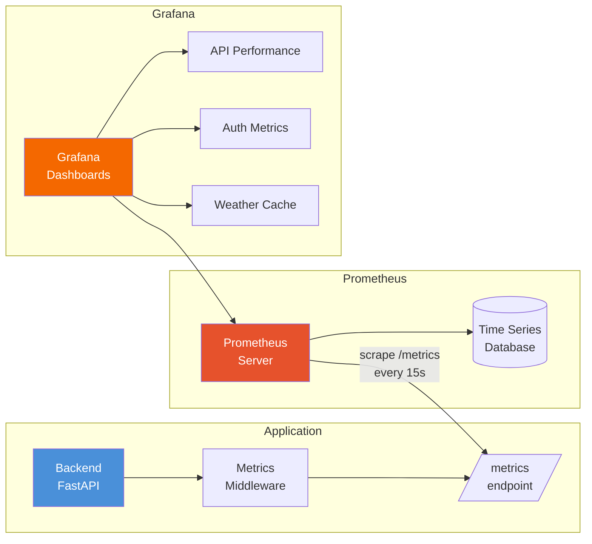

# Interactive Architecture Visualization

## Overview

This document provides interactive Mermaid diagrams for exploring the Tequipy architecture at different levels of detail.

## Live Architecture Explorer

### Request Flow Visualization

The following diagram shows how a request flows through the system:



### Authentication Flow



### Weather API Flow



### Component Dependency Graph



### Kubernetes Deployment Architecture



### Metrics Collection Flow



## How to Use These Diagrams

### Viewing in GitHub/GitLab

All diagrams use [Mermaid](https://mermaid.js.org/) syntax and render automatically in:

- GitHub README/Markdown files
- GitLab README/Markdown files
- VS Code with Mermaid extension

### Editing Diagrams

1. Use the [Mermaid Live Editor](https://mermaid.live/) for real-time preview
2. Copy diagram code from this file
3. Modify and preview
4. Copy back to this file

### Exporting to Images

```bash
# Using mermaid-cli
npm install -g @mermaid-js/mermaid-cli
mmdc -i 09-interactive-visualization.md -o diagrams/

# Or use the Live Editor export feature
```

## Diagram Legend

| Color            | Meaning                |
| ---------------- | ---------------------- |
| Blue (#4a90d9)   | API/Presentation Layer |
| Orange (#f5a623) | Domain/Business Layer  |
| Green (#7ed321)  | Infrastructure Layer   |
| Purple (#9013fe) | Data Stores            |
| Red (#d0021b)    | External Services      |
| Cyan (#50e3c2)   | Monitoring             |

## Related Documentation

- [System Context (C4 Level 1)](./01-system-context.md)
- [Container Architecture (C4 Level 2)](./02-container-architecture.md)
- [Component Architecture (C4 Level 3)](./03-component-architecture.md)
- [Deployment Architecture](./06-deployment-architecture.md)
