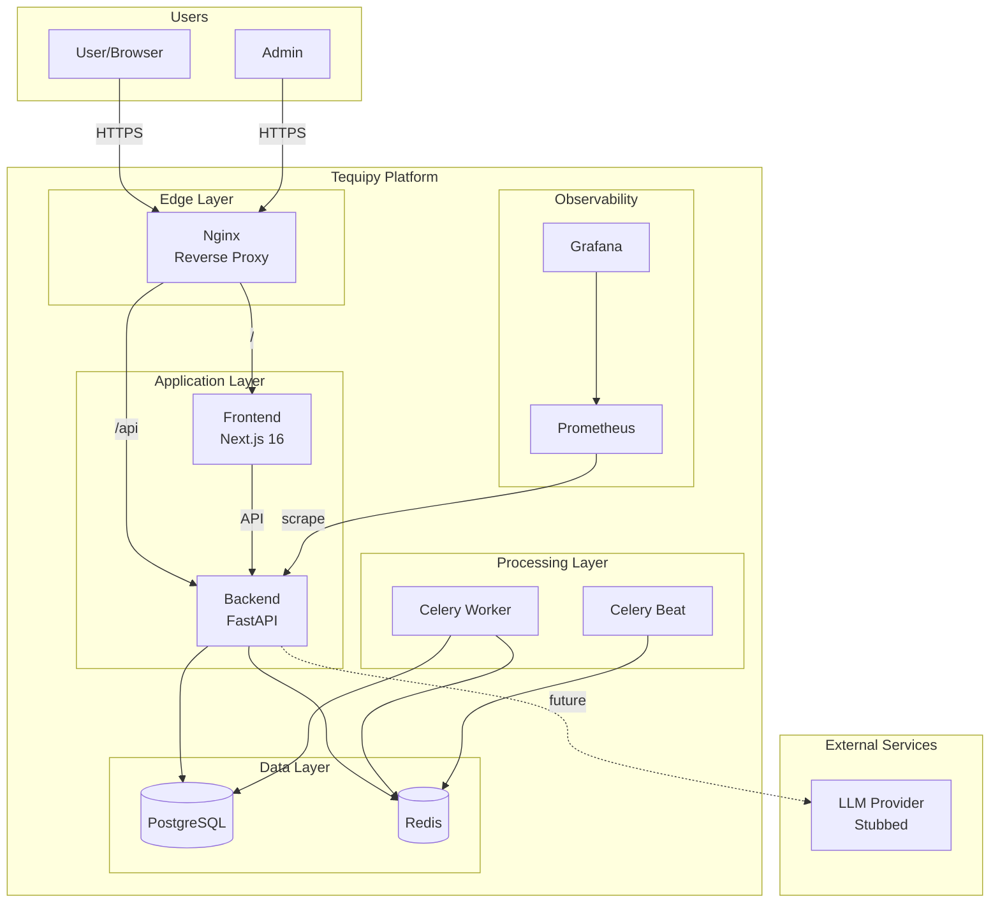
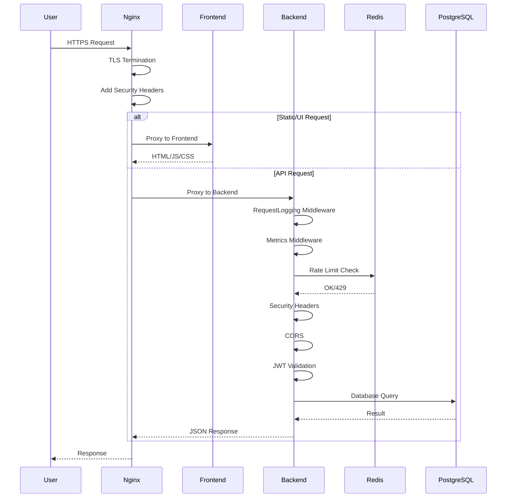

# Tequipy Architecture Documentation

> Comprehensive architecture documentation for the Tequipy platform using C4 model, ADRs, and interactive diagrams.

## Quick Navigation

| Document                                                   | Description                                    | Audience              |
| ---------------------------------------------------------- | ---------------------------------------------- | --------------------- |
| [System Context](./01-system-context.md)                   | C4 Level 1 - High-level system overview        | All stakeholders      |
| [Container Architecture](./02-container-architecture.md)   | C4 Level 2 - Docker services and communication | DevOps, Backend       |
| [Component Architecture](./03-component-architecture.md)   | C4 Level 3 - Internal module structure         | Developers            |
| [Data Architecture](./04-data-architecture.md)             | Database schema, data flows, Redis usage       | Backend, DBA          |
| [Security Architecture](./05-security-architecture.md)     | Auth flows, security controls, compliance      | Security, Backend     |
| [Deployment Architecture](./06-deployment-architecture.md) | Infrastructure, scaling, monitoring            | DevOps, SRE           |
| [Cross-Cutting Concerns](./07-cross-cutting-concerns.md)   | Error handling, logging, observability         | All developers        |
| [API Reference](./08-api-reference.md)                     | REST API endpoints and contracts               | Frontend, Integration |

## Architecture Decision Records

See [ADR Index](../adr/README.md) for all architectural decisions.

| ADR                                                | Decision              | Impact                       |
| -------------------------------------------------- | --------------------- | ---------------------------- |
| [ADR-0001](../adr/0001-layered-architecture.md)    | Layered Architecture  | Backend structure            |
| [ADR-0002](../adr/0002-jwt-authentication.md)      | JWT Authentication    | Security model               |
| [ADR-0003](../adr/0003-repository-pattern.md)      | Repository Pattern    | Data access                  |
| [ADR-0004](../adr/0004-http-client-and-caching.md) | HTTP Client & Caching | External integrations        |
| [ADR-0005](../adr/0005-frontend-architecture.md)   | Frontend Architecture | Frontend structure           |
| [ADR-0006](../adr/0006-api-client-design.md)       | API Client Design     | Frontend-Backend integration |

## System Overview



## Technology Stack

### Backend

| Component       | Technology         | Version |
| --------------- | ------------------ | ------- |
| Runtime         | Python             | 3.12+   |
| Framework       | FastAPI            | Latest  |
| ORM             | SQLAlchemy (async) | 2.x     |
| Migrations      | Alembic            | Latest  |
| Task Queue      | Celery             | 5.x     |
| Package Manager | uv                 | Latest  |

### Frontend

| Component       | Technology   | Version      |
| --------------- | ------------ | ------------ |
| Framework       | Next.js      | 16           |
| UI Library      | React        | 19           |
| Language        | TypeScript   | 5.x (strict) |
| Styling         | Tailwind CSS | 4            |
| Testing         | Playwright   | Latest       |
| Package Manager | npm          | Latest       |

### Infrastructure

| Component        | Technology     | Version     |
| ---------------- | -------------- | ----------- |
| Reverse Proxy    | Nginx          | 1.27-alpine |
| Database         | PostgreSQL     | 16-alpine   |
| Cache/Broker     | Redis          | 7-alpine    |
| Monitoring       | Prometheus     | 2.54        |
| Dashboards       | Grafana        | 11.4        |
| Containerization | Docker Compose | Latest      |

## Key Architectural Patterns

### Backend Patterns

```
┌─────────────────────────────────────────────────────────────────┐
│                        API Layer                                 │
│  FastAPI Routers → Pydantic Schemas → Middleware Stack          │
└─────────────────────────────────────────────────────────────────┘
                              │
                              ▼
┌─────────────────────────────────────────────────────────────────┐
│                      Domain Layer                                │
│  Entities → Services → Repository Interfaces → Exceptions       │
└─────────────────────────────────────────────────────────────────┘
                              ▲
                              │
┌─────────────────────────────────────────────────────────────────┐
│                   Infrastructure Layer                           │
│  SQLAlchemy Models → Repository Impls → JWT/Auth → Metrics      │
└─────────────────────────────────────────────────────────────────┘
```

**Key Patterns:**

- **Clean Architecture**: Dependency inversion with domain at center
- **Repository Pattern**: Abstract data access behind interfaces
- **Service Layer**: Business logic encapsulated in domain services
- **Middleware Chain**: Cross-cutting concerns via composable middleware

### Frontend Patterns

```
┌─────────────────────────────────────────────────────────────────┐
│                        Pages (App Router)                        │
│  Route handlers with client-side interactivity                  │
└─────────────────────────────────────────────────────────────────┘
                              │
              ┌───────────────┼───────────────┐
              ▼               ▼               ▼
┌─────────────────┐ ┌─────────────────┐ ┌─────────────────┐
│   Components    │ │    Contexts     │ │     Hooks       │
│  Reusable UI    │ │  Global State   │ │  Custom Logic   │
└─────────────────┘ └─────────────────┘ └─────────────────┘
              │               │               │
              └───────────────┼───────────────┘
                              ▼
┌─────────────────────────────────────────────────────────────────┐
│                        Library Layer                             │
│  API Client → Types → Utilities → Configuration                 │
└─────────────────────────────────────────────────────────────────┘
```

**Key Patterns:**

- **App Router**: File-based routing with React Server Components support
- **Context API**: Global auth state management
- **Singleton API Client**: Centralized HTTP communication
- **Custom Hooks**: Reusable async logic (useApi, useApiPolling)

## Request Flow



## Directory Structure

```
tequipy/
├── backend/
│   ├── src/
│   │   ├── api/           # FastAPI routers, middleware, schemas
│   │   ├── domain/        # Business entities, services, interfaces
│   │   ├── infrastructure/# DB, auth, repositories, external services
│   │   ├── core/          # Configuration, logging, utilities
│   │   └── worker/        # Celery tasks and configuration
│   ├── alembic/           # Database migrations
│   └── tests/             # Backend tests
├── frontend/
│   ├── src/
│   │   ├── app/           # Next.js App Router pages
│   │   ├── components/    # Reusable React components
│   │   ├── contexts/      # React context providers
│   │   ├── hooks/         # Custom React hooks
│   │   ├── lib/           # API client, types, utilities
│   │   └── styles/        # Global CSS and Tailwind
│   └── tests/             # Playwright E2E tests
├── docs/
│   ├── architecture/      # This documentation
│   └── adr/              # Architecture Decision Records
├── nginx/                 # Reverse proxy configuration
├── prometheus/            # Monitoring configuration
├── grafana/              # Dashboard definitions
└── docker-compose.yml    # Container orchestration
```

## Getting Started

### Prerequisites

- Docker and Docker Compose
- Node.js 22+ (for local frontend development)
- Python 3.12+ with uv (for local backend development)

### Quick Start

```bash
# Clone and setup
git clone <repo>
cd tequipy

# Copy environment files
cp backend/.env.example backend/.env
cp frontend/.env.example frontend/.env

# Start all services
docker compose up -d --build

# Run migrations
docker compose exec backend uv run alembic upgrade head

# Seed test data (optional)
make seed
```

### Access Points

| Service     | URL                        | Credentials |
| ----------- | -------------------------- | ----------- |
| Frontend    | http://localhost           | -           |
| Backend API | http://localhost:8000      | -           |
| API Docs    | http://localhost:8000/docs | -           |
| Grafana     | http://localhost:3001      | admin/admin |
| PgAdmin     | http://localhost:5050      | See .env    |

## Contributing to Architecture

1. **New Features**: Consider architectural impact and update relevant docs
2. **Major Changes**: Create an ADR before implementation
3. **Diagrams**: Use Mermaid for consistency and version control
4. **Reviews**: Include architecture team for significant changes

## Diagram Notation

All diagrams use [Mermaid](https://mermaid.js.org/) syntax for version-controlled, text-based diagrams that render in GitHub/GitLab.

## Document History

| Version | Date    | Changes                                                        |
| ------- | ------- | -------------------------------------------------------------- |
| 1.0     | 2025-01 | Initial architecture documentation                             |
| 1.1     | 2025-01 | Added cross-cutting concerns, API reference, enhanced overview |
